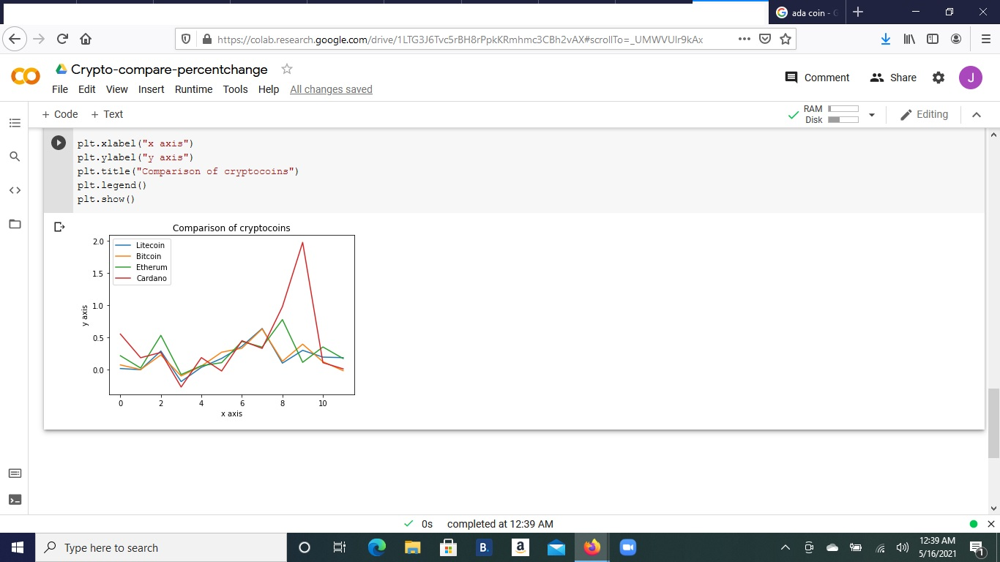

# Ecoin Trends
 
## Introduction
-
    Ever since the inception of bitcoins, electronic coins have become
very popular to invest money in.  If invested early, bitcoin value grew
exponentially for a long time.  Since then, there have been competors.
Just as in the e-commerce field, ebay was the only game in town for a
while.  Amazon replaced ebay, and there were very many other competitors
that people can sell a decent amount of inventory.  The competetors to
bitcoin include Litecoin, Ethereum, Zcash, and Dash.  I have been recenlty
been watching the trends of coins.  So far I have done the best with Etherum

## Methods
**
    There are many statistical methods to use for choosing coins.  Lately,
there has been a surge in cryptocurrency coins.  Different regressions, of
course, could help decide which coin to buy

    To start with, I decided to download the coin price history from yahoo.
I then used numpy to compare the percent change

### Current Screenshot

