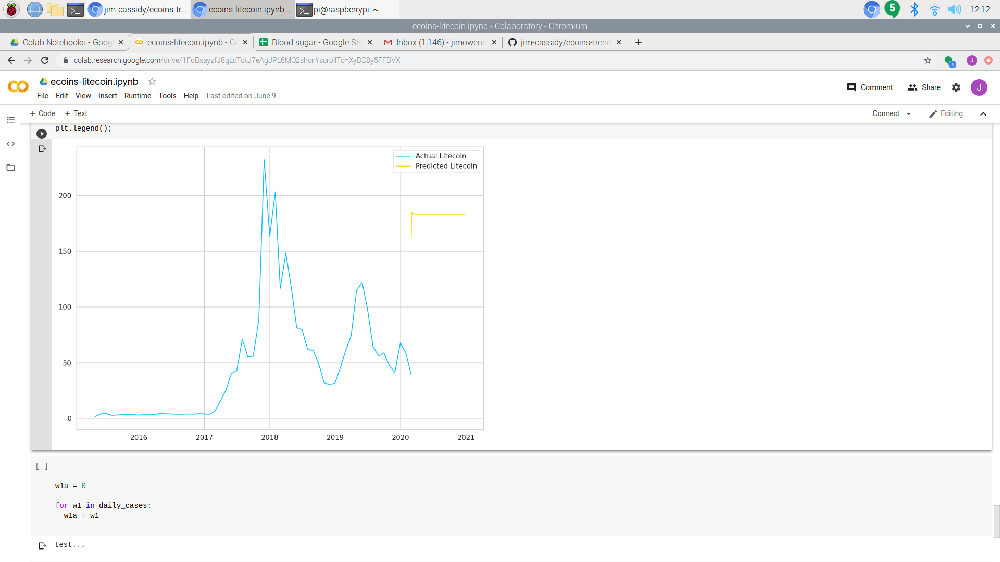
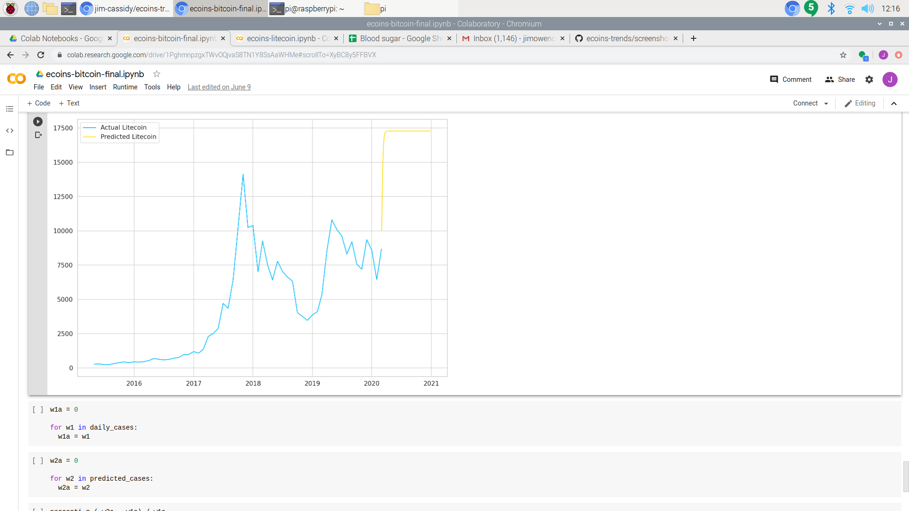
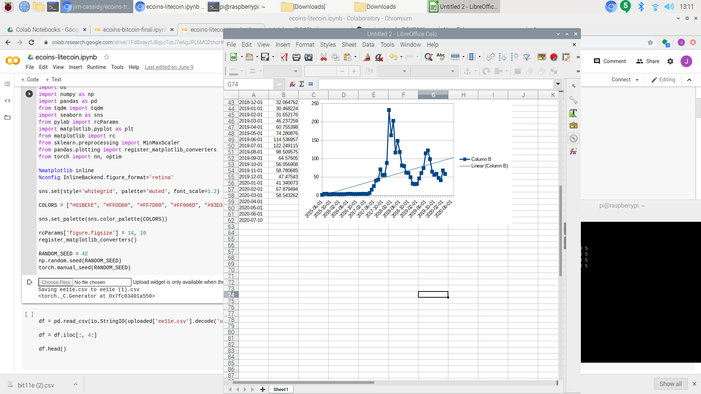

# Ecoin Trends
 
## Introduction

    Ever since the inception of bitcoins, electronic coins have become
very popular to invest money in.  If invested early, bitcoin value grew
exponentially for a long time.  Since then, there have been competors.
Just as in the e-commerce field, ebay was the only game in town for a
while.  Amazon replaced ebay, and there were very many other competitors
that people can sell a decent amount of inventory.  The competetors to
bitcoin include Litecoin, Ethereum, Zcash, and Dash.  I want to diversify
my invesment to make sure my money is invested optimally.

## Methods

    I will be using two methods to predict the trends of bitcoins.  The 
first method I will use is the old-fashioned linear regression.  I will be
using not only linear, but polynomial regression.  The second method I will
use is a deep learning method with neural networks.

## Prediction before I analyze the data with statistics

   I have been looking at both bitoin and litecoin.  From what I see in
the trendline is bitcoin is going up faster than litecoin as a percentage.

## Deep Learning: Litecoin vs. Bitcoin

### Litcoin Values over time : Deep learning

### Bitcoin Values over time : Deep learning

### Litecoin Values over time

!### Litecoin Values over time

### Bitcoin Prices over time 

### Litecoin Prediction
 

 
### Bitcoin Prediction

### Prediction : Percent increase

    For Deep Learning, I compared the prediction percent increase.
Litecoin is predicting close to a 400% increase.  Bitcoin
is predicting about a 70% increase

## Classical Regression

